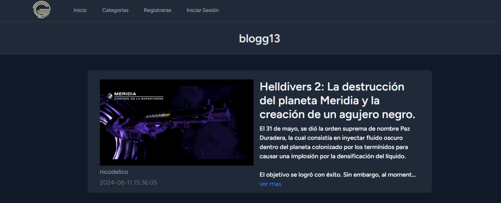

# Trabajo práctico Laravel
Trabajo práctico de Laravel de la materia Programación Web Avanzada.

El objetivo es desarrollar un blog que cuente con artículos breves
con contenido actualizado y novedoso sobre temas específicos o libres.

## BloGG13
Nuestro proyecto contiene posts sobre videojuegos y películas. Si se inicia sesión, 
se pueden crear o editar posts que hayamos publicado. Se pueden acceder a los perfiles
de los usuarios para ver sus publicaciones en el blog.

## Instalación
1. Clonar el repositorio desde el terminal con el comando `git clone <link-repositorio>`.

2. Posicionar el terminal dentro de la carpeta blogg13.

3. Ejecutar el comando `composer install` para instalar las dependencias.

4. Ejecutar el comando `npm install` para instalar las dependencias.

5. Copiar el archivo `.env.example`, pegarlo y cambiar el nombre a `.env`. 
    -Un comando útil es `cp .env.example .env`.

6. Ejecutar el comando `php artisan key:generate` para generar una clave para la app.

7. Migrar la base de datos con el comando `php artisan migrate`.

8. Ejecutar el comando `npm run build` para configurar las necesidades de Breeze.

9. En un terminal aparte, ejecutar el comando `npm run dev`.

10. Ejecutar el comando `php artisan serve` para ejecutar la aplicación.

**Aclaraciones:**
* Node.js y Composer son necesarios para ejecutar la aplicación.

## Integrantes

| Nombre             | Legajo   | Github                                                   |
|:------------------:|:--------:|:-------------------------------------------------------: |
| Nicolás Maldonado  | FAI-3196 | [Perfil de Github](https://github.com/axelnicomaldonado) |
| Thomas Rifo        | FAI-4296 | [Perfil de Github](https://github.com/ThomasRifo)        |
| Julián Blanco      | FAI-3858 | [Perfil de Github](https://github.com/juliaanbl)         |
| Marco Pistagnesi   | FAI-4407 | [Perfil de Github](https://github.com/elpista)           |